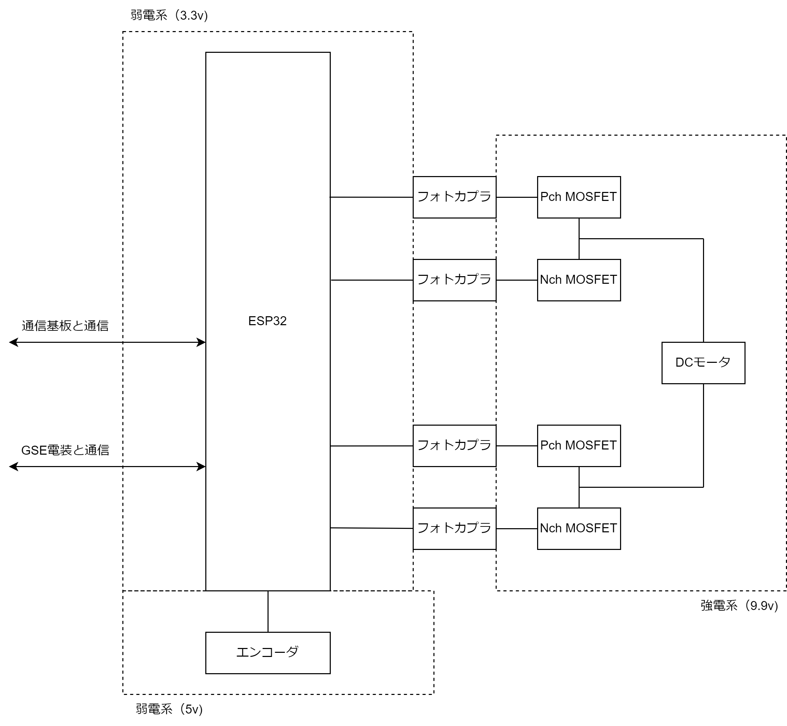
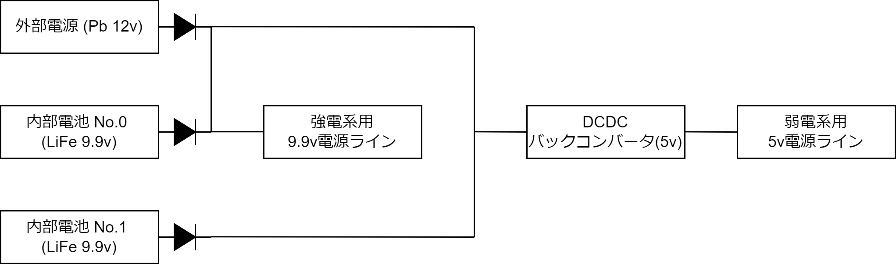
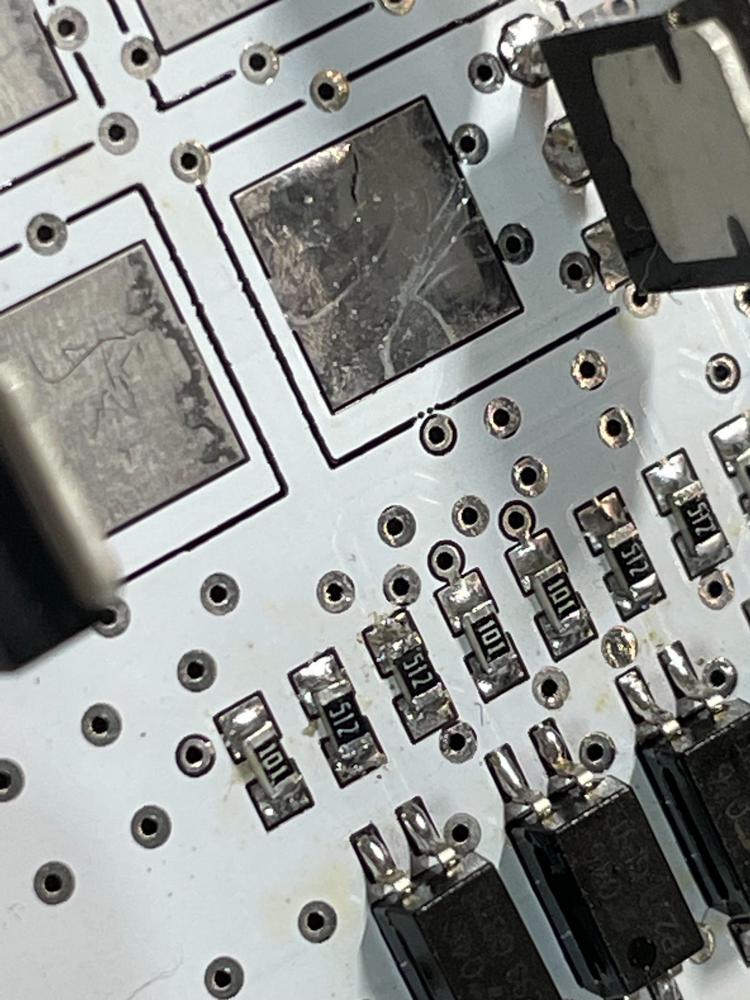

# バルブシステム電装系システム概要

本機に搭載するバルブシステムの電装は、ロケット搭載基板および地上GSE電装から構成される。ロケット搭載基板の役割は、メインバルブを制御することである。また、地上GSEの役割は、GSEを制御すること、および点火操作に合わせてロケット搭載基板と通信を行い、ロケット搭載基板を制御することである。

両者はフライトピンによって締結され、ロケットの離床と同時に切断される。

## ロケット搭載基板

ロケット搭載基板のシステムチャートを下図に示す。

弱電系は制御、通信を行う電気系であり、電源は9.9v LiFeバッテリーから電源基板にて5vに降圧されて供給される。マイクロコントローラはESP32を用いる。

強電系はDCモータを駆動する電気系であり、電源は9.9v Li-Feバッテリーを用いる。過電流保護のため3Aのリセッタブルヒューズが直列に接続されている。
Pch MOSFETおよびNch MOSGETから構成されるHブリッジによってDCモータを駆動する。DCモーターはメインバルブの開閉に用いる。

強電系と弱電系の間の通信はフォトカプラによって絶縁される。

下図に本基板の電源構成図を示す。内部電源・外部電源がともに接続されている場合、ダイオードによって外部電源が選択され、内部電源からは電力が供給されないような設計である。

下表に本基板における主要パーツを示す。

| ブロック名             | 型番                | 備考                                      |
|-------------------------|----------------------|----------------------------------------------|
| エンコーダ付きDCモータ | 備考参照            | [https://www.pololu.com/product/2828](https://www.pololu.com/product/2828) |
| Pch MOSFET             | MTB060P06I3         | 60V 16.7A                                 |
| Nch MOSFET             | MTB30N06I3          | 60V 22A                                   |
| フォトカプラ           | TLP785(GB F)        | Nch MOSFET(BSS138)を用いてドライブ        |
| ESP32                  | ESP32-WROOM-32E-N16 |                                           |

## GSE電装

GSE電装のシステムチャートを下図に示す。

弱電系は制御、通信を行う電気系であり、マイクロコントローラはESP32を用いる。

強電系はイグナイタ・および電磁弁を駆動する電気系である。キースイッチをオンにすることで電源が投入され、キースイッチを抜くと電源が切れる設計である。

強電系と弱電系の間の通信はフォトカプラ・絶縁レギュレータによって絶縁される。

下表に本基板における主要パーツを示す。

| ブロック名 | 型番 | 備考 |
| --- | --- | --- |
| リレー | 953-1C-24DG-1 | N.O. |
| Nch MOSFET | 2SK4017 | 60V 5A 電磁弁用、電磁弁の両極に保護のためダイオードを取付 |
| Nch MOSFET | TK5R3A06PL | 60V 56A イグナイタ用、電磁弁の両極に保護のためダイオードを取付 |
| フォトカプラ | TLP785(GB F) |  |
| ESP32 | ESP32-WROOM-32E-N16 |  |

## メインバルブ駆動用DCモータの制御について

## 点火シーケンス時の電装システムの動作について

常にコントローラ基板のボタンの情報は10Hzで中継基板に送信されている。

中継基板にて点火ボタン押下を検知した場合、酸素の電磁弁をONにし、イグナイタを発火、バルブ基板に対し動作開始コマンドを送信する。

バルブ基板は1秒後バルブを開く。

## バルブシステム電装 開発履歴
バルブシステム電装の開発にあたり発生した問題とその詳細について以下にまとめる。

### バルブ基板 v1.0.0
パッドとビアが近接していたこと、ビアのレジストによるカバーがなかったことにより短絡が発生した。

前者に対しては設計の際近距離にビアを配置しないこと、後者についてはEagleの設定にて対処。
