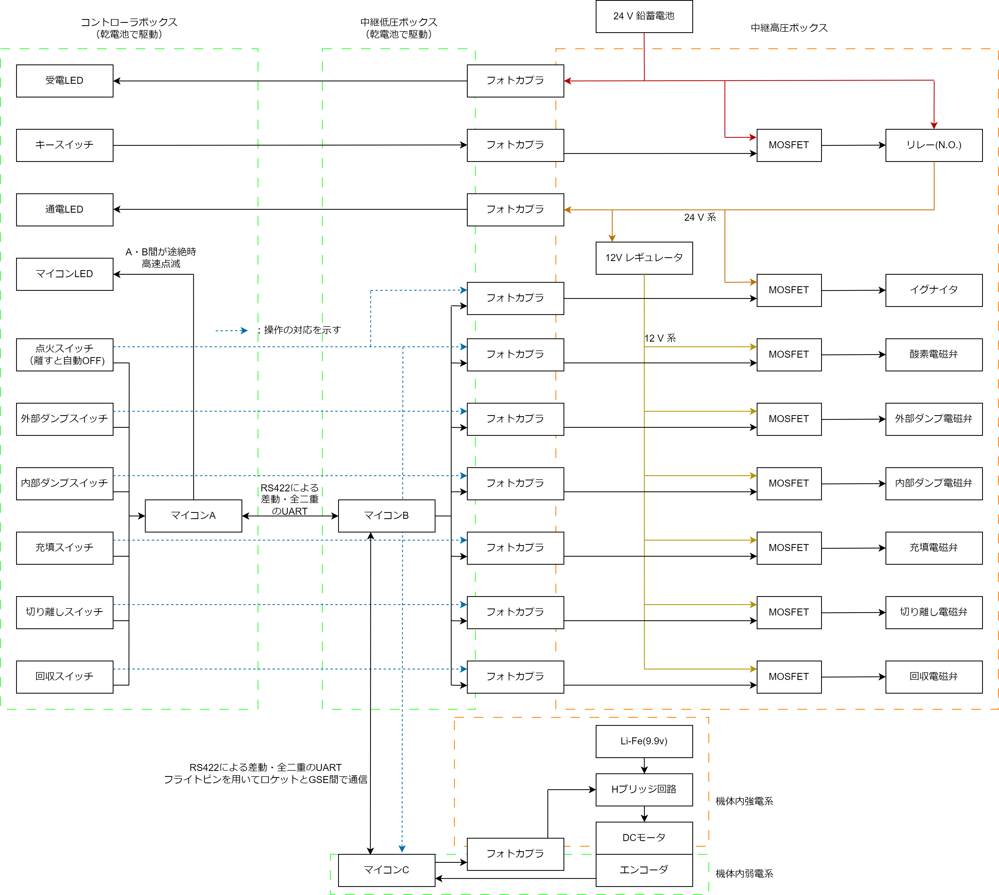

# バルブシステム電装系システム概要

本機に搭載するバルブシステムの電装は、ロケット搭載基板および地上GSE電装から構成される。ロケット搭載基板の役割は、メインバルブを制御することである。また、地上GSEの役割は、GSEを制御すること、および点火操作に合わせてロケット搭載基板と通信を行い、ロケット搭載基板を制御することである。

両者はフライトピンによって締結され、ロケットの離床と同時に切断される。

## ロケット搭載基板

ロケット搭載基板のシステムチャートを下図に示す。

弱電系は制御、通信を行う電気系であり、マイクロコントローラはESP32を用いる。

強電系はDCモータを駆動する電気系であり、Pch MOSFETおよびNch MOSGETから構成されるHブリッジによってDCモータを駆動する。DCモーターはメインバルブの開閉に用いる。

強電系と弱電系の間の通信はフォトカプラによって絶縁される。

下図に本基板の電源構成図を示す。内部電源・外部電源がともに接続されている場合、ダイオードによって外部電源が選択され、内部電源からは電力が供給されないような設計である。

下表に本基板における主要パーツを示す。

| ブロック名             | 型番                | 備考                                      |
|-------------------------|----------------------|----------------------------------------------|
| エンコーダ付きDCモータ | 備考参照            | [https://www.pololu.com/product/2828](https://www.pololu.com/product/2828) |
| Pch MOSFET             | MTB060P06I3         | 60V 16.7A                                 |
| Nch MOSFET             | MTB30N06I3          | 60V 22A                                   |
| フォトカプラ           | TLP785(GB F)        | Nch MOSFET(BSS138)を用いてドライブ        |
| ESP32                  | ESP32-WROOM-32E-N16 |                                           |

## GSE電装

GSE電装のシステムチャートを下図に示す。

弱電系は制御、通信を行う電気系であり、マイクロコントローラはESP32を用いる。

強電系はイグナイタ・および電磁弁を駆動する電気系である。キースイッチをオンにすることで電源が投入され、キースイッチを抜くと電源が切れる設計である。

強電系と弱電系の間の通信はフォトカプラ・絶縁レギュレータによって絶縁される。

下表に本基板における主要パーツを示す。

| ブロック名 | 型番 | 備考 |
| --- | --- | --- |
| リレー | G4A-1A-E DC24 | ノーマルオープン |
| 12v レギュレータ | NJM7812FA | ヒートシンクを取り付けて使用 |
| Nch MOSFET | MTB30N06I3 | 60V 22A 電磁弁用、電磁弁の両極に保護のためダイオードを取付 |
| Nch MOSFET | TK5R3A06PL | 60V 56A イグナイタ用、電磁弁の両極に保護のためダイオードを取付 |
| フォトカプラ | TLP785(GB F) |  |
| 絶縁レギュレータ(5v) | MAU105 |  |
| ESP32 | XIAO ESP32C3 |  |

## メインバルブ駆動用DCモータの制御について

## 点火シーケンス時の電装システムの動作について