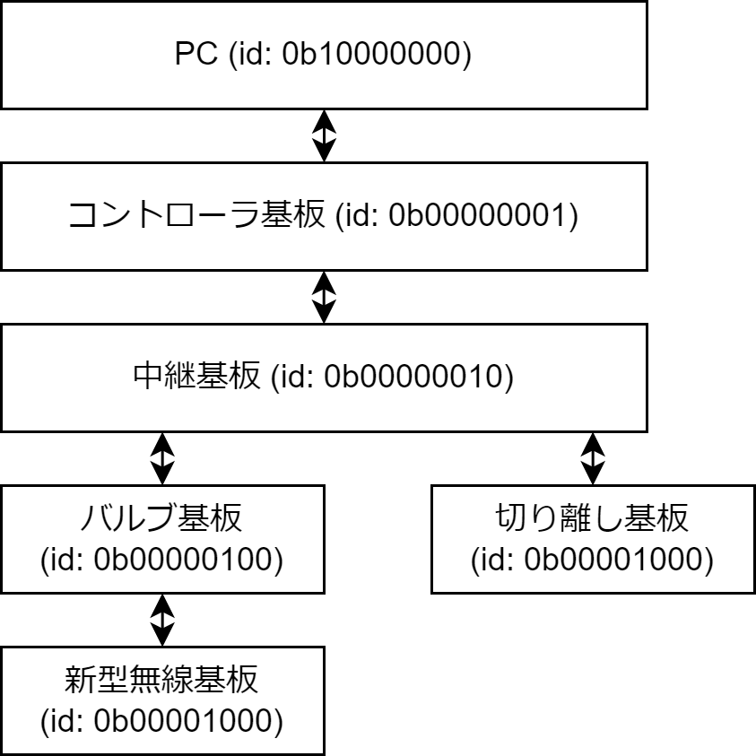

# バルブシステム 通信仕様書

# 通信プロトコルの仕様
| head(1byte) | cmdid(1byte) | length(1byte)    | parameters(nbyte) | CRC(1byte)    |
|-------------|--------------|------------------|-------------------|---------------|
| `0x43`      |              | n+4              |                   |               |

CRCによって通信エラーを検知し，通信エラーの場合そのパケットは破棄するとする．

通信エラーの際，マイコン側で充填電磁弁を切断する等のことは行わない．非常時の対処はコントローラのキースイッチを抜き、パワー系の電源を切断し行う．

パリティはパラメータの総和を63倍し，256で割った余りである．

# 各基板に付与されるIDについて
ackに使用される各ノードのIDは以下である。ackの帰り値の条件のため8ノードが上限とする。
 - `PC`...`0b10000000`
 - `コントローラ基板`...`0b00000001`
 - `中継基板`...`0b00000010`
 - `拡張1（バルブ基板）`...`0b00000100`
 - `拡張2（切り離し基板）`...`0b00001000`

 

# コマンド詳細

## 1. ack
| head(1byte) | cmdid(1byte) | length(1byte)    | parameters(1byte) | CRC(1byte)    |
|-------------|--------------|------------------|-------------------|---------------|
| `0x43`      | `0x00`       | 5                | 到達ノードid       |               |

PCから中継基板に向けて1Hzで発行される．

PC以外ではackを受信した場合、
 - 自ノードより下位にノードが存在する場合、自ノードのIDをparametersにOR演算し、下位のノードに送信。一定時間待機し，末端のノードから応答を待ち，応答ackのパラメータ全てをOR演算し，上位ノードに送信．下位ノードからの応答が全てない場合は上位ノードから送られてきた
 - 下位ノードが存在しない場合、自ノードのIDをparametersにOR演算し、上位のノードに送信

所定の待ち時間は以下の通り
 - `コントローラ基板`...`200ms`
 - `中継基板`...`100ms`

 根拠...1000ms / 115200 bps * 8 bits * 5 bytes * 2 = 8.328 ms
 根拠とは...?

## 2. スイッチ状態転送コマンド
| head(1byte) | command(1byte) | length(1byte)    | parameters(1byte) | CRC(1byte)    |
|-------------|----------------|------------------|-------------------|---------------|
| `0x43`      | `0x21`         | 5                |  `0bEFGH0000`     |               |

コントローラ基板から中継基板に10 Hzで発行．
`EFGH`...それぞれ外部ダンプ，内部ダンプ，充填，点火スイッチのステータス．`0b1`の場合ONで，`0b0`の場合OFF．

## 3. バルブ操作コマンド
| head(1byte) | command(1byte) | length(1byte)    | parameters(1byte) | CRC(1byte)    |
|-------------|----------------|------------------|-------------------|---------------|
| `0x43`      | `0x71`         | 5                |  `0b0000000I`     |               |

PC→コントローラ→中継→バルブ基板に転送される．また，点火スイッチが押された場合，同タイミングで中継基板からバルブ基板に発行．
`I`...`0`の場合バルブを閉じ，`1`の場合開く

## 4. バルブ基板テレメトリ送信コマンド
| head(1byte) | command(1byte) | length(1byte)    | parameters(30byte) | CRC(1byte)    |
|-------------|----------------|------------------|-------------------|---------------|
| `0x43`      | `0x61`         | `0d11`           |                   |               |

| param[0-3]  | param[4-5]     | param[6-13]      | param[14-21]     | param[22-29]     |
|-------------|----------------|------------------|------------------|------------------|
| time        | pulsecounter   | target_angle     | motor_angle      | d_motor_angle    |
|             |                |                  |                  |                  |