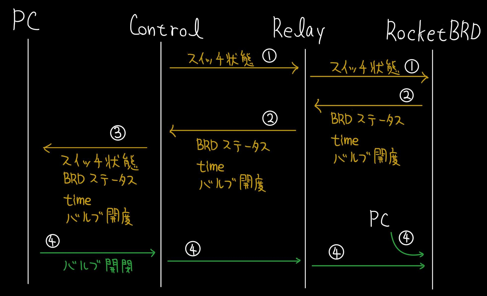

# C-71L バルブシステム 通信仕様書

# 通信フロー概要

# 通信プロトコルの仕様
| head(1byte) | command(1byte) | length(1byte)    | parameters(nbyte) |
|-------------|----------------|------------------|-------------------|
| `0x71`      |                | n+3              |                   |

通信コマンドはackと組み立て時バルブ開閉だけにしたい

点火シーケンス前は1Hzのackを流し，点火シーケンス中は100Hzのackを流す

通信エラーの際，マイコン側で充填電磁弁を切断する等のことは，なにもしない．非常時の対処は点火点にてキルスイッチを押すことで行う．

## 1. スイッチ状態転送コマンド
| head(1byte) | command(1byte) | length(1byte)    | parameters(1byte) |
|-------------|----------------|------------------|-------------------|
| `0x71`      | `0x21`         | 4                |  `0bEFGH00PP`     |

`EFGH`...それぞれ外部ダンプ，内部ダンプ，充填，点火スイッチのステータス．`0b1`の場合ONで，`0b0`の場合OFF．

`PP` ...上のうちONになってるものの数のmod4

## 2. ロケット基板テレメトリ送信コマンド
| head(1byte) | command(1byte) | length(1byte)    | parameters(5byte) |
|-------------|----------------|------------------|-------------------|
| `0x71`      | `0x38`         | 8                |                   |

| param[0-1]  | param[2-3]     | param[4]         |
|-------------|----------------|------------------|
| time        | pulsecounter   | BRDstatus        |
|             |                | `0bXYZ000PP`     |

`X` ... 基板がアクティブかどうか．アクティブなら`0b1`，light sleep中なら`0b0`．

`YZ` ... 基板の動作モード．

`PP` ... XYZに含まれる1の数

## 3. GSEバルブシステムテレメトリ送信コマンド
| head(1byte) | command(1byte) | length(1byte)    | parameters(6byte) |
|-------------|----------------|------------------|-------------------|
| `0x71`      | `0x61`         | 9                | 1+2               |

## 4. 強制遷移コマンド
| head(1byte) | command(1byte) | length(1byte)    | parameters(1byte) |
|-------------|----------------|------------------|-------------------|
| `0x71`      | `0xAA`         | 4                | `0bXYZHIPPP`      |

`X` ... 基板をアクティブにするかどうか．アクティブにするなら`0b1`，light sleepにするなら`0b0`．

`YZ` ... 動作モードを強制的に指定する．

`H` ... `0b1`の場合バルブの開度を強制的に指定する．開閉は`I`を参照

`I` ... バルブについて，`0b1`の場合開き，`0b0`の場合閉める．