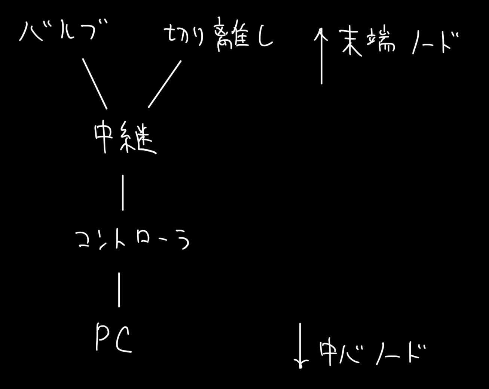

# バルブシステム 通信仕様書

# 通信プロトコルの仕様
| head(1byte) |destination(1byte)| cmdid(1byte) | length(1byte)    | parameters(nbyte) | parity(1byte) |
|-------------|------------------|--------------|------------------|-------------------|---------------|
| `0x71`      |                  |              | n+5              |                   |               |

parityによって通信エラーを検知し，通信エラーの場合そのパケットは破棄するとする．

通信エラーの際，マイコン側で充填電磁弁を切断する等のことは行わない．非常時の対処はコントローラのキースイッチを抜き、パワー系の電源を切断し行う．

パリティはパラメータの総和を63倍し，256で割った余りである．

# 各基板に付与されるIDについて
通信プロトコルのdestinationおよびackに使用される各ノードのIDは以下である。ackの帰り値の条件のため8ノードが上限とする。
 - `PC`...`0b10000000`
 - `コントローラ基板`...`0b00000001`
 - `中継基板`...`0b00000010`
 - `拡張1（バルブ基板）`...`0b00000100`
 - `拡張2（切り離し基板）`...`0b00001000`

 

# コマンド詳細

## 1. ack
| head(1byte) |destination(1byte)| cmdid(1byte) | length(1byte)    | parameters(1byte) | parity(1byte) |
|-------------|------------------|--------------|------------------|-------------------|---------------|
| `0x71`      |                  |              | n+5              |                   |               |

ackを受信した場合は末端のノードに送信する。

## 2. スイッチ状態転送コマンド
| head(1byte) | command(1byte) | length(1byte)    | parameters(1byte) | parity(1byte) |
|-------------|----------------|------------------|-------------------|---------------|
| `0x71`      | `0x21`         | `0x05`           |  `0bEFGH0000`     |               |

`EFGH`...それぞれ外部ダンプ，内部ダンプ，充填，点火スイッチのステータス．`0b1`の場合ONで，`0b0`の場合OFF．

## 2. ロケット基板テレメトリ送信コマンド
| head(1byte) | command(1byte) | length(1byte)    | parameters(6byte) | parity(1byte) |
|-------------|----------------|------------------|-------------------|---------------|
| `0x71`      | `0x61`         | `0d12`           |                   |               |

| param[0]    | param[1-4]  | param[5-6]     | param[7]         |
|-------------|-------------|----------------|------------------|
| swstatus    | time        | pulsecounter   | BRDstatus        |
| same as 1   |             |                | `0bXYZ000RR`     |

`X` ... 基板がアクティブかどうか．アクティブなら`0b1`，light sleep中なら`0b0`．

`YZ` ... 基板の動作モード．

`RR` ... 通信がどこまで到達したかを示す．`00`でロケット基板まで到達，`01`で中継基板まで到達，`10`で中継基板に到達せず．

## 3. 強制遷移コマンド
| head(1byte) | command(1byte) | length(1byte)    | parameters(1byte) | parity(1byte) |
|-------------|----------------|------------------|-------------------|---------------|
| `0x71`      | `0xEE`         | `0x05`           |  `0b0X0YZ0H0`     |               |

`X` ... 基板をアクティブにするかどうか．アクティブにするなら`0b1`，light sleepにするなら`0b0`．

`YZ` ... 動作モードを強制的に指定する．

`H` ... `0b1`の場合バルブの開度を強制的に指定する．開閉のどちらかにするかは`I`を参照

`I` ... バルブについて，`0b1`の場合開き，`0b0`の場合閉める．

応答は1.2.によってわかるため返さないとする．